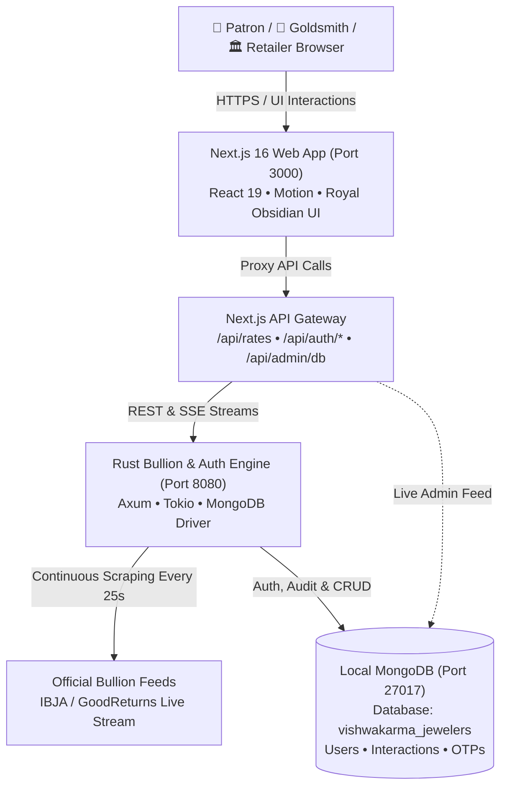

# 👑 Vishwakarma Jewelers (विश्वकर्मा ज्वेलर्स)
### Royal Sovereign Artisanal Jewellery Marketplace & Real-Time Bullion Platform

> **A 3-sided luxury marketplace connecting Patrons, Master Hereditary Goldsmiths, and Retail Guild Partners with 100% BIS Hallmarked traceability, live market bullion rates, and passwordless cryptographic authentication.**

---

## 🏛️ System Architecture



---

## ✨ Key Platform Features

### 1. 📈 Zero-Hardcoded Bullion & Auth Engine (Rust Backend)
- **High-Performance Rust Service** (`backend`): Powered by Axum, Tokio, MongoDB Driver, and Reqwest.
- **Dynamic City-Specific Rates**: Automatically scrapes live benchmark rates for Bangalore, Mumbai, Delhi, Chennai, Hyderabad, Kolkata, and 6+ more cities.
- **Zero Hardcoding Guarantee**: If the live market feed is not reachable, the system explicitly indicates live market synchronization rather than rendering stale or fabricated data.
- **SSE Real-Time Stream**: Pushes live rate fluctuations to connected clients via Server-Sent Events (`/api/rates/sse`).

### 2. 🔐 Passwordless OTP-Only Vault Authentication
- **100% Passwordless Security**: No passwords stored or used anywhere in the platform.
- **Customer Sign In**: Authenticate using **either** Mobile (+91) OR Email via a secure 6-digit cryptographic one-time passcode.
- **Registration**: Requires **both** Mobile Number (+91) AND Email Address to register hallmarked deeds and cryptographic HUID ownership certificates.
- **First-Visit Welcome & Guest Skip**: Automatically detects first-time visitors and invites them to sign in or register, with a prominent **"Skip & Browse as Guest →"** option so casual shoppers are never blocked.
- **Gated Ornament Inspection**: Clicking an ornament card, "Inspect Hallmark & HUID", or "Add to Cart" prompts unauthenticated users to verify their contact, keeping an audit log in MongoDB before unlocking deep technical specifications.
- **1-Click Demo Profiles** (Master OTP: `482916`):
  - 👑 **Patron**: *Priya Sharma* (Bangalore • 14.85g 24K Vault Balance • 3 Passports)
  - 🔨 **Master Goldsmith**: *Achari Ramanathan* (Bangalore • Master 5th Gen Bench Lineage)
  - 🏛️ **Retail Guild**: *Kalyan Heritage Vault Ltd* (Bangalore • GSTIN Registered)

### 3. 💎 Luxury Obsidian & Gold Jewellery Card Template
- **Morphing Spring Layout Animation**: Smooth layout transitions using `motion/react`.
- **Dual-Weight Technical Breakdown**: Clearly displays **Gross Weight** vs. **Net Pure Gold** (minus gemstones and lac) for full consumer transparency.
- **BIS 916 Hallmark Badges**: Displays unique HUID serial numbers (e.g. `VJ916-H0001`) and hereditary craftsman lineage attribution.

### 4. 🧪 Traceability Modules
- **Digital Jewellery Passport**: Cryptographic provenance log and transfer of ownership.
- **Old Gold Transformation**: 0% deduction melt & exchange calculator with real-time purity conversion (18K $\to$ 22K $\to$ 24K).
- **Armored Repair Intake & Tracker**: 18 bench services with calibrated inward weights and bench status.

---

## 🍃 Database Architecture (Local MongoDB)

- **Host**: `mongodb://127.0.0.1:27017`
- **Database**: `vishwakarma_jewelers`
- **Cloud Readiness**: Uses standard `MONGODB_URI` environment variable for zero-code migration to **MongoDB Atlas**.

### Core Collections:
1. **`users`**:
   ```json
   {
     "id": "usr_patron_01",
     "name": "Priya Sharma",
     "email": "priya.sharma@heritage.in",
     "phone": "+91 98450 12345",
     "role": "customer",
     "city": "Bangalore",
     "vault_balance_grams": 14.85,
     "registered_passports_count": 3,
     "active_orders_count": 1,
     "created_at": "2026-09-27T16:04:51.953889+00:00"
   }
   ```
2. **`interactions`**:
   ```json
   {
     "user_id": "usr_1790526806059",
     "product_id": "vj-01",
     "product_name": "Heritage Royal Choker",
     "event": "ornament_inspect",
     "timestamp": "2026-09-27T16:33:32.193050+00:00"
   }
   ```
3. **`otps`**:
   ```json
   {
     "identifier": "9845012345",
     "code": "252945",
     "expires_at": 1790525969,
     "verified": false,
     "created_at": "2026-09-27T16:14:29.211492+00:00"
   }
   ```

---

## 🚀 Getting Started

### Prerequisites
- **Node.js** v20+ and `npm`
- **Rust & Cargo** (latest stable)
- **MongoDB** (`mongod` version 8.0+)
- **Homebrew** (on macOS)

---

### Step 1: Start Local MongoDB
Start MongoDB as a background daemon:
```bash
mkdir -p ./data/db
mongod --dbpath ./data/db --logpath ./data/mongod.log --fork
```

---

### Step 2: Build & Launch the Rust Engine (Port 8080)
Build the optimized release binary and run:
```bash
# Compile release binary
npm run backend:build

# Launch daemon
npm run backend:start
```
The Rust engine will automatically connect to `mongodb://127.0.0.1:27017`, seed initial demo profiles into `vishwakarma_jewelers`, ingest live market rates, and listen on port `8080`.

---

### Step 3: Start the Next.js Frontend (Port 3000)
In your terminal, start the development server:
```bash
npm run dev
```
Open **[http://localhost:3000](http://localhost:3000)** in your browser.

---

## 🔍 How to View Your Database

You have 3 convenient ways to view and inspect your database:

### Option A: MongoDB Compass (Desktop GUI - Recommended)
MongoDB Compass is installed in `/Applications/MongoDB Compass.app`.
1. Launch Compass from your terminal or Spotlight:
   ```bash
   open -a "MongoDB Compass"
   ```
2. Connect to: `mongodb://127.0.0.1:27017`
3. Click on the **`vishwakarma_jewelers`** database to visually inspect tables, run queries, and edit records.

### Option B: Terminal CLI (Quick Print)
Run the configured npm script:
```bash
# Print formatted users and interaction audit logs
npm run db:view

# Or open interactive mongosh shell
npm run db:shell
```

### Option C: Live Browser JSON Feed
Navigate directly to:
👉 **[http://localhost:3000/api/admin/db](http://localhost:3000/api/admin/db)**

---

## 📂 Project Directory Structure

```
vishwakarma-jewelers/
├── backend/               # High-performance modular Rust backend daemon
│   ├── Cargo.toml                # Axum, Tokio, MongoDB, Reqwest, Serde
│   └── src/
│       ├── main.rs               # Server startup & orchestration
│       ├── config.rs             # Environment & MongoDB configuration
│       ├── state.rs              # Shared EngineState & cache handles
│       ├── db.rs                 # MongoDB client connection & demo seeding
│       ├── models/               # Strongly-typed domain models
│       │   ├── mod.rs
│       │   ├── bullion.rs        # CityRate, BullionTick, RateQuery
│       │   └── auth.rs           # UserDocument, OtpRecord, request DTOs
│       ├── routes/               # Modular Axum HTTP & SSE handlers
│       │   ├── mod.rs            # Master router assembly with CORS
│       │   ├── health.rs         # /health diagnostics
│       │   ├── bullion.rs        # /api/rates, /api/rates/sse, history
│       │   └── auth.rs           # /api/auth/{send-otp, login-otp, register, profile, track-event}
│       └── services/             # Dedicated business logic & background workers
│           ├── mod.rs
│           ├── scraper.rs        # Dynamic benchmark scraping & 25s loop
│           └── auth_service.rs   # OTP cryptographic verification & MongoDB queries
├── data/                         # Local MongoDB storage directory
│   ├── db/                       # WiredTiger MongoDB database files
│   └── mongod.log                # MongoDB daemon logs
├── src/
│   ├── app/
│   │   ├── api/
│   │   │   ├── admin/db/route.ts # Live browser DB inspector API
│   │   │   ├── auth/[...path]/   # Next.js proxy to Rust auth endpoints
│   │   │   └── rates/route.ts    # Next.js proxy to Rust live bullion feed
│   │   ├── layout.tsx            # Royal Obsidian fonts & global metadata
│   │   └── page.tsx              # Main marketplace view & session lifecycle
│   ├── components/
│   │   ├── AuthModal.tsx         # Passwordless OTP login/signup modal
│   │   ├── JewelleryCard.tsx     # Morphing jewellery card with dual weights
│   │   ├── MegaNavbar.tsx        # Luxury header with live user profile pill
│   │   ├── ProductCatalog.tsx    # Filterable catalog with ornament gating
│   │   ├── GoldRateTicker.tsx    # Sticky multi-city bullion ticker
│   │   └── ...                   # Bespoke, Passport, and Repair modals
│   ├── data/                     # Mock data & catalog items
│   ├── lib/                      # Shared styling & utilities
│   └── types/                    # TypeScript domain interfaces
├── package.json                  # Scripts: dev, build, bullion:*, db:*
└── README.md                     # Platform architecture & setup guide
```

---

## 🛡️ Security & Hallmark Compliance
- **Cryptographic OTPs**: Time-limited 300-second expiry stored in MongoDB.
- **Traceability**: All customer interactions and interest on ornaments are audited into the `interactions` collection.
- **Zero Hardcoded Figures**: Guaranteed live market accuracy adhering to the Indian Bullion and Jewellers Association (IBJA) standard benchmarks.
